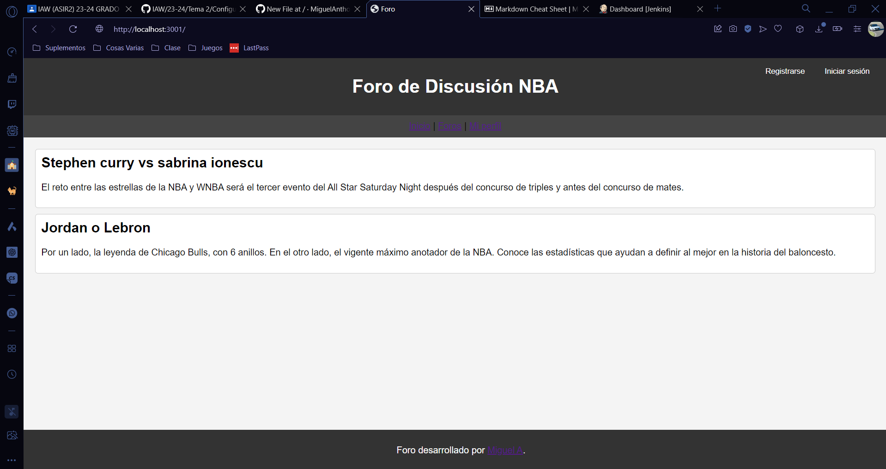

## Como iniciar la app

# Requesitos

Para poder ejecutar esté código necesitaremos.
### Crear la base de datos
Necesitaremos crear la base de datos de Proyecto.

`create database Proyecto`

Una vez creado la base de datos crearemos la tabla.

`CREATE TABLE registro (
    nombre VARCHAR(100) NOT NULL PRIMARY KEY,
    password VARCHAR(100) NOT NULL
);`

Ya creado la base de datos y con todo descargado ejecutaremos el node 

# Ejecución 

Lanzaremos esté código en el terminal en la carpeta donde esté el script

`npm install script.js`

# Visualización del proyecto

Esto sería la página inicial del proyecto 